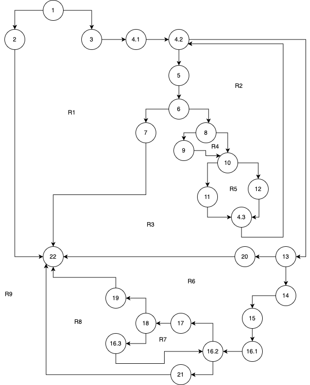
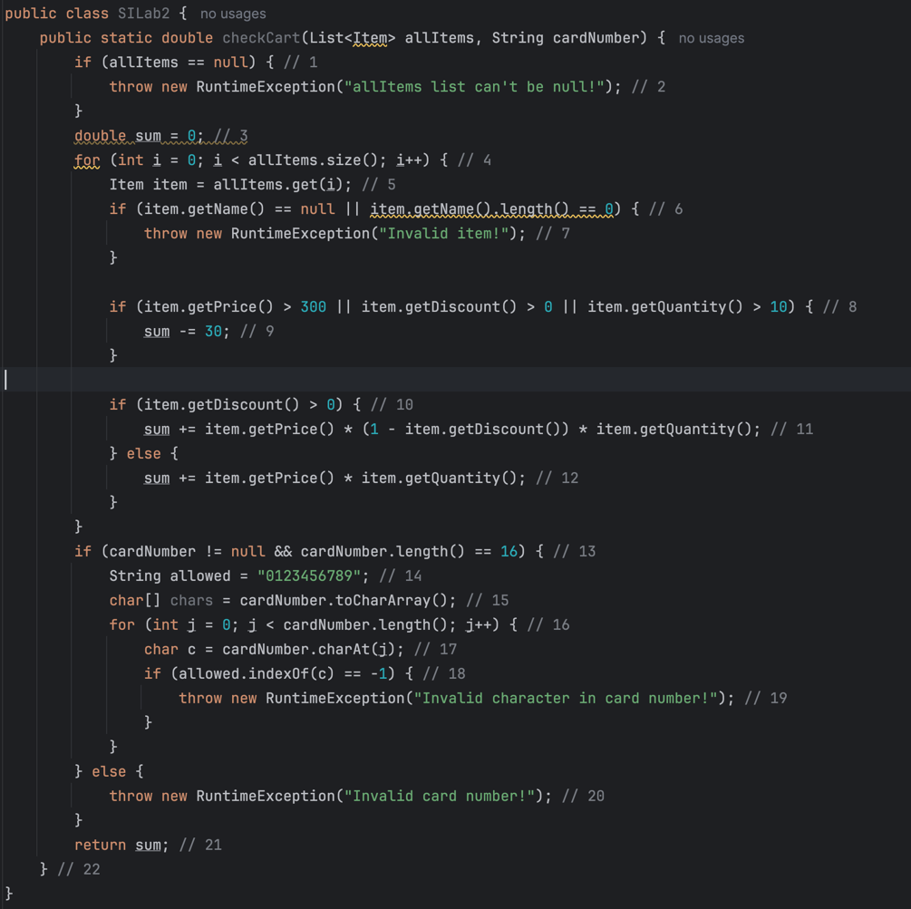

# SI_2025_lab2_236029

Андреј Милевски 236029

2. 
   
3. Цикломатската комплексност на дадениот код е 9. Решението го добив со броење на регионите во графот обележани на цртежот.
4. 
- Тест 1: allItems = null, cardNumber = '' - 1, 2, 22
- Тест 2: allItems = [{name='', quantity=x, price=x, discount=x}], cardNumber = '' - 1, 3, 4.1, 4.2, 5, 6, 7, 22
- Тест 3: allItems = [{name='Apple', quantity=1, price=1, discount=0.1}], cardNumber = '' - 1, 3, 4.1, (4.2, 5, 6, 8, 9, 10, 11, 4.3), 13, 20, 22
- Тест 4: allItems = [{name='Apple', quantity=1, price=1, discount=0}], cardNumber = '123a456789123456' - 1, 3, 4.1, (4.2, 5, 6, 8, 10, 12, 4.3), 13, 14, 15, 16.1, (16.2, 17, 18, 16.3), 19, 22
- Тест 5: allItems = [{name='Apple', quantity=1, price=1, discount=0}], cardNumber = '1234567891234567' - 1, 3, 4.1, (4.2, 5, 6, 8, 10, 12, 4.3), 13, 14, 15, 16.1, (16.2, 17, 18, 16.3), 21, 22

За да се постигне овој критериум потребни се минимум 5 теста.

5. 
- TXX: allItems = [{name='Apple', quantity=0, price=310, discount=0}]
- FTX: allItems = [{name='Apple', quantity=0, price=1, discount=0.1}]
- FFF: allItems = [{name='Apple', quantity=0, price=0, discount=0}]
- FFT: allItems = [{name='Apple', quantity=15, price=0, discount=0}]

За да се постигне овој критериум потребни се минимум 4 теста.

6.
Unit тестовите ги напишав со помош на assert изрази за да проверам дали фрлаат Exception и дали резултатите што се добиваат се точни.
